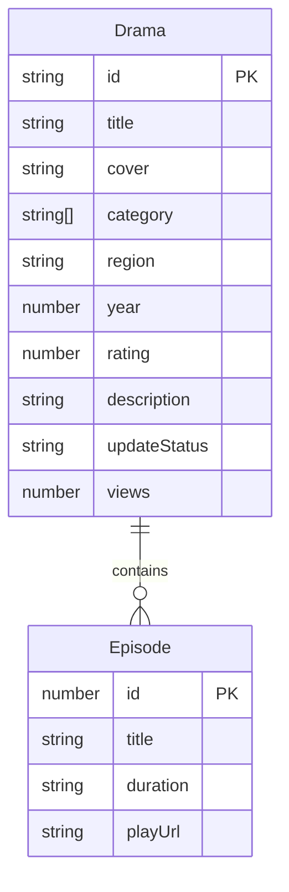

## 1. 架构设计

```mermaid
flowchart TB
    subgraph "前端层"
        "Vue 3 + TypeScript"
        "Vue Router"
        "Pinia 状态管理"
        "Tailwind CSS"
    end
    subgraph "数据层"
        "Mock 数据"
        "本地 JSON 数据"
    end
    "前端层" --> "数据层"
```

纯前端项目，使用 Mock 数据模拟后端接口，后续可对接苹果CMS等后端系统。

## 2. 技术说明
- 前端：Vue 3 + TypeScript + Tailwind CSS + Vite
- 初始化工具：vite-init
- 后端：无（使用 Mock 数据）
- 数据库：无（使用本地 JSON 模拟数据）

## 3. 路由定义
| 路由 | 用途 |
|------|------|
| / | 首页，展示推荐、分类、热门短剧 |
| /category | 分类页，按类型/地区/年份筛选 |
| /search | 搜索页，关键词搜索短剧 |
| /detail/:id | 详情页，短剧信息和剧集列表 |
| /play/:id/:ep | 播放页，视频播放和选集 |

## 4. API 定义（Mock）

### 4.1 短剧数据类型
```typescript
interface Drama {
  id: string
  title: string
  cover: string
  category: string[]
  region: string
  year: number
  rating: number
  description: string
  episodes: Episode[]
  tags: string[]
  updateStatus: string
  views: number
  cast: string[]
  director: string
}

interface Episode {
  id: number
  title: string
  duration: string
  playUrl: string
}
```

### 4.2 Mock 接口
| 接口 | 方法 | 描述 |
|------|------|------|
| /api/home | GET | 首页数据（轮播、推荐、热门、排行） |
| /api/drama/list | GET | 短剧列表（支持筛选参数） |
| /api/drama/detail/:id | GET | 短剧详情 |
| /api/search | GET | 搜索结果 |

## 5. 服务器架构图
不适用（纯前端项目）

## 6. 数据模型

### 6.1 数据模型定义


### 6.2 数据定义语言
使用 TypeScript 接口定义数据结构，Mock 数据以 JSON 文件形式存储在 `src/mock/` 目录下。
